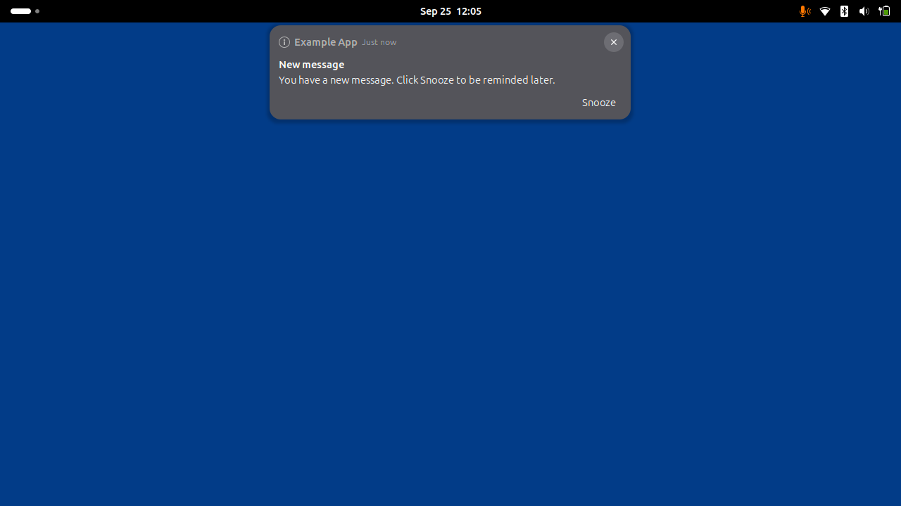

# Snooze Notification

A GNOME Shell extension (GNOME 50 / Ubuntu 26.04) that adds a **Snooze** button
to every notification popup. Clicking it hides the notification and re-shows
the same notification after a configurable delay.



## How it works

- The extension watches for new notification banners and appends a `Snooze`
  button under the banner text.
- Clicking `Snooze` hides the banner through GNOME Shell's own hide path (no
  focus/fullscreen leaks) and schedules the notification to re-appear after the
  configured delay.
- Re-showing reuses GNOME Shell's own re-banner mechanism — the notification is
  simply marked "unseen" again.

## Install

From a checkout (live development):

```bash
ln -s "$(pwd)" \
  ~/.local/share/gnome-shell/extensions/snooze-notification@felipe.reyes.github.io
gnome-extensions enable snooze-notification@felipe.reyes.github.io
```

On Wayland you must re-login (or restart the shell) for the extension to be
picked up after installation. Alternatively, install from the packed zip:

```bash
gnome-extensions install snooze-notification@felipe.reyes.github.io.shell-extension.zip
```

## Configure

Open the extension's preferences:

```bash
gnome-extensions prefs snooze-notification@felipe.reyes.github.io
```

Set **Snooze delay (minutes)** between 1 and 120 (default 5).

## Known caveats

- Snoozes are **in-memory only**: they are lost on screen lock, logout, or when
  the extension is disabled. A snoozed notification re-appears (unseen) rather
  than being silently dropped when the extension is disabled.
- The Snooze button appears on **popup banners only**, not in the calendar /
  message list.
- If Do Not Disturb is active when a snooze expires, the notification is left
  in the message list instead of re-popping.

## Project identifiers

- UUID: `snooze-notification@felipe.reyes.github.io`
- Settings schema: `org.gnome.shell.extensions.snooze-notification`
- Gettext domain: `snooze-notification@felipe.reyes.github.io`

> Before submitting to extensions.gnome.org, replace `felipe.reyes.github.io`
> with your own GitHub username or a domain you control (a single
> `git grep -l` change across `metadata.json`, `schemas/`, and `po/`).

## Development

```bash
# Unit tests (deterministic, no GNOME Shell required)
./tests/run.sh

# Integration test (runs a nested headless shell)
dbus-run-session -- gnome-shell-test-tool --headless \
  --extension snooze-notification@felipe.reyes.github.io.shell-extension.zip \
  tests/integration/snoozeCycle.js

# Package for extensions.gnome.org
gnome-extensions pack --force --podir=po --extra-source=lib .
```

## License

GPL-2.0-or-later
